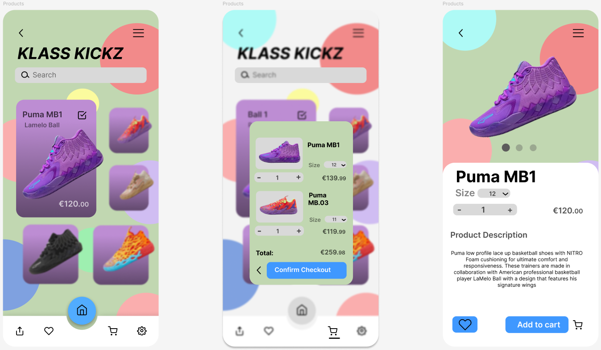
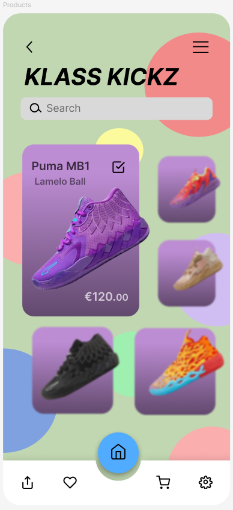
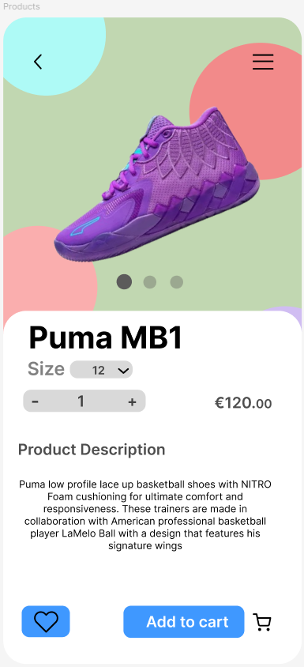
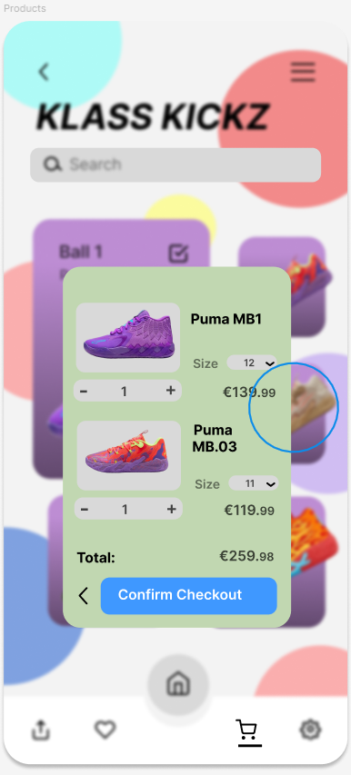

[README.md](https://github.com/user-attachments/files/27735818/README.md)
# Klass Kickz 👟

A mobile app UI design for a sneaker e-commerce store, built in **Figma**. The design covers the core shopping flow — browsing products, viewing product details, and checking out.

---

## Screens

### All Screens Overview

---

### Home Screen
Browse available sneakers with product cards showing name, brand, and price.

---

### Product Detail
View a full product image, description, size selector, quantity control, and add to cart button.

---

### Cart & Checkout
Review selected items, sizes, quantities, total price, and confirm the order.

---

## Demo

[Watch Demo](https://github.com/kent-blanco/klass-kickz/blob/main/KLASS_KICKZ.mp4)

---

## Design Details

- **Tool:** Figma
- **Platform:** Mobile (iOS style)
- **Style:** Playful, colourful with a purple and green palette
- **Key Features Designed:**
  - Product listing grid with featured card
  - Search bar and navigation bar
  - Product detail page with image carousel
  - Size and quantity selectors
  - Cart overlay with itemised order summary and total
  - Confirm checkout flow

---

## Developer

**Kent Philip Blanco**  
QQI Level 6 Advanced Software Development
Mobile Technologies - Mobile App UI Design Project
